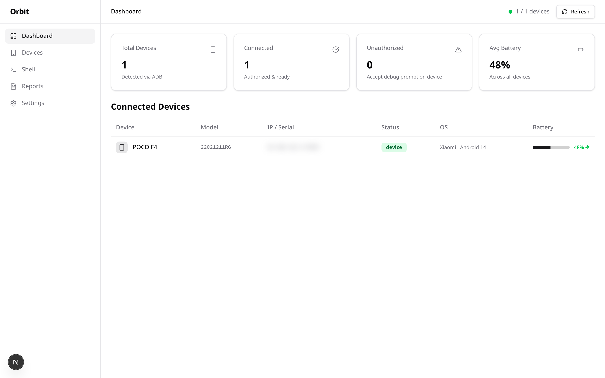
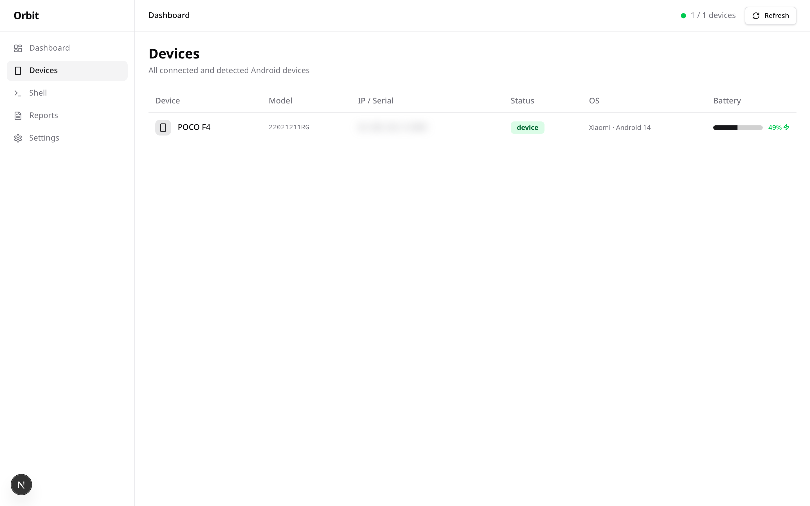
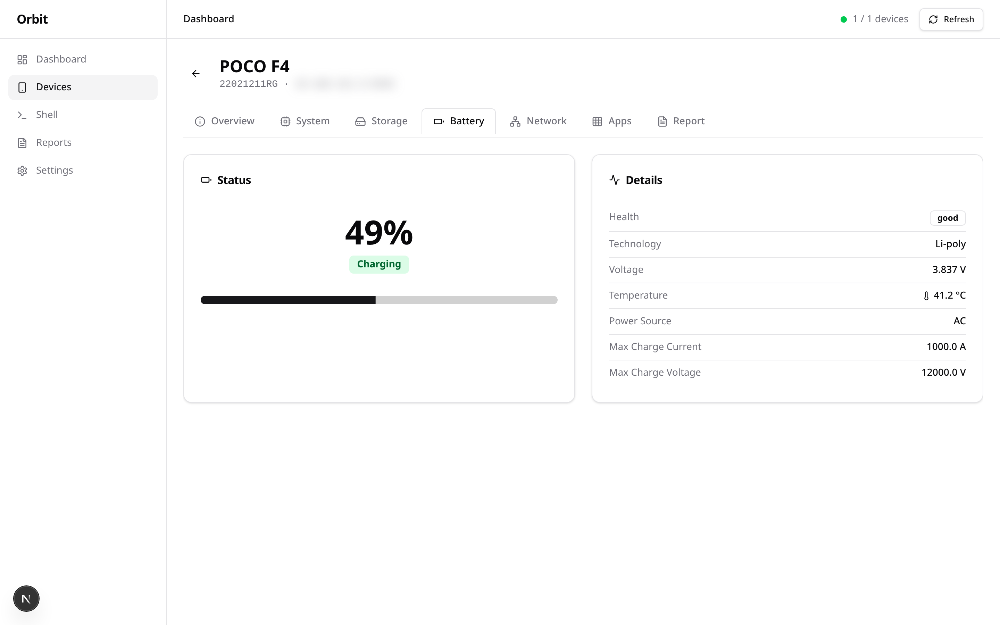
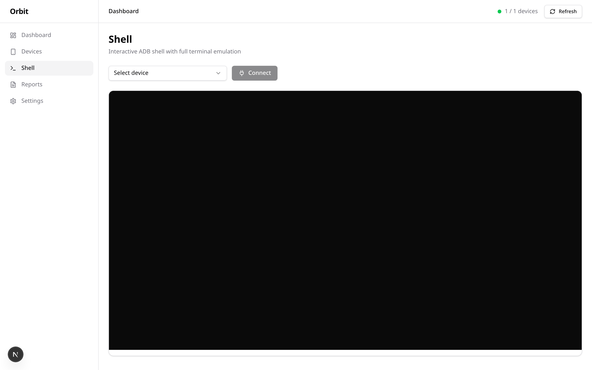
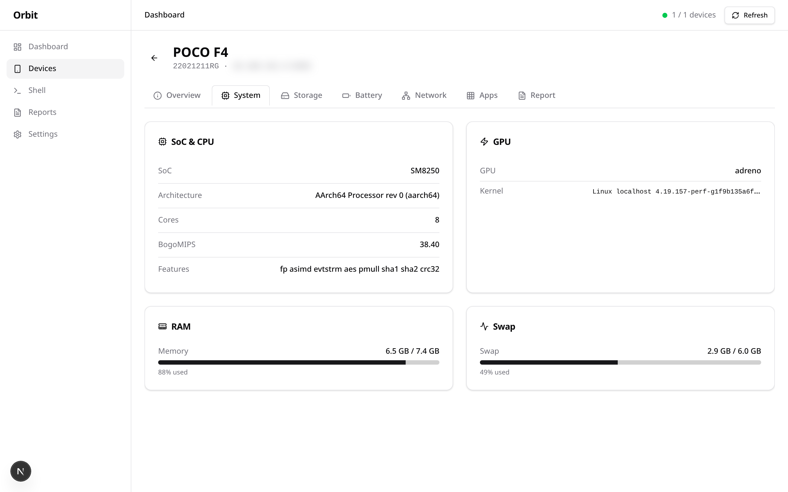
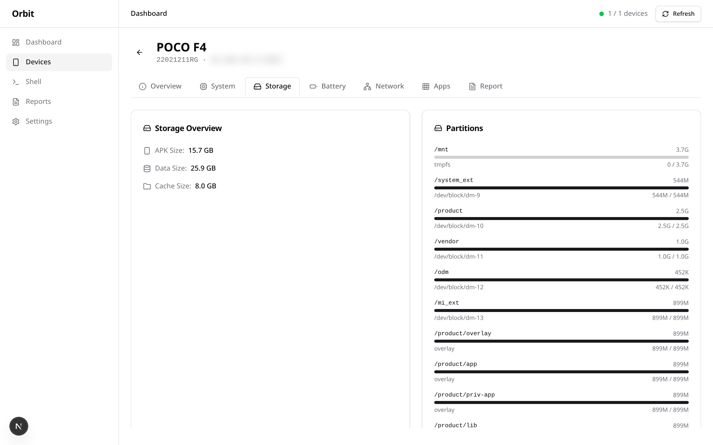
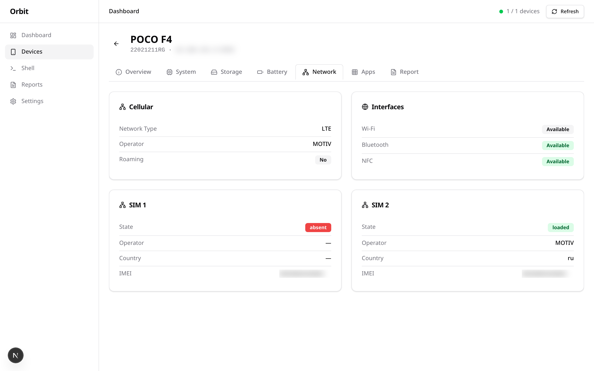
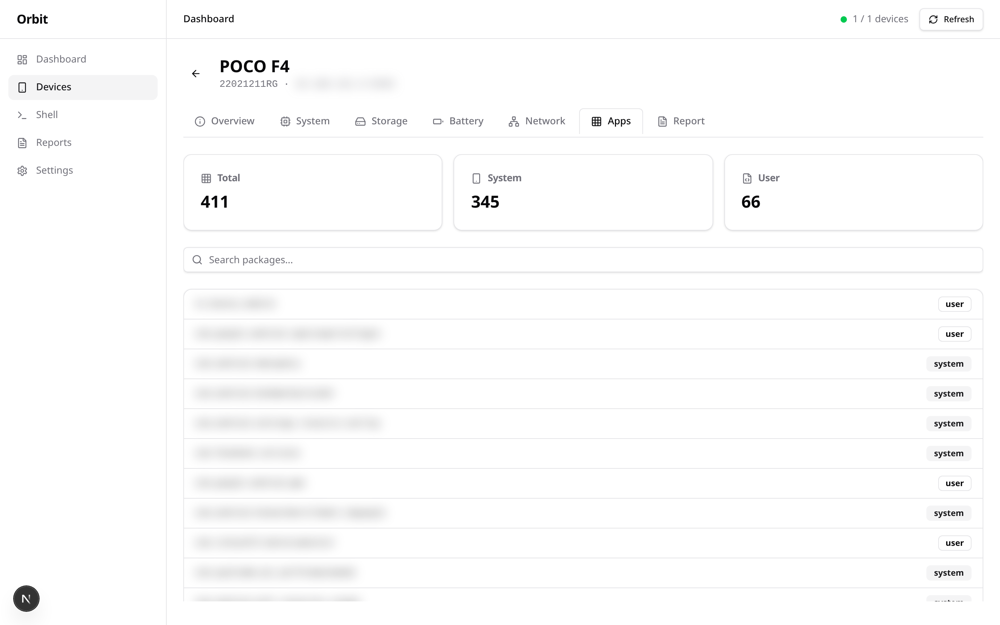
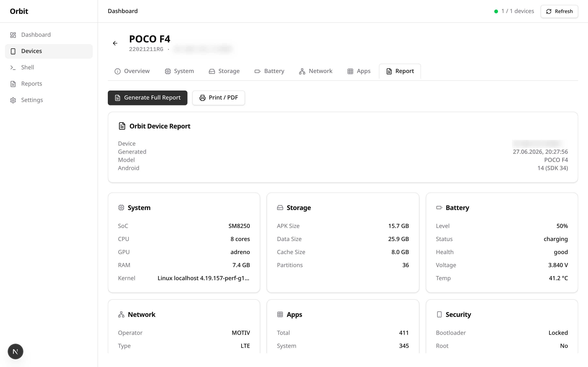
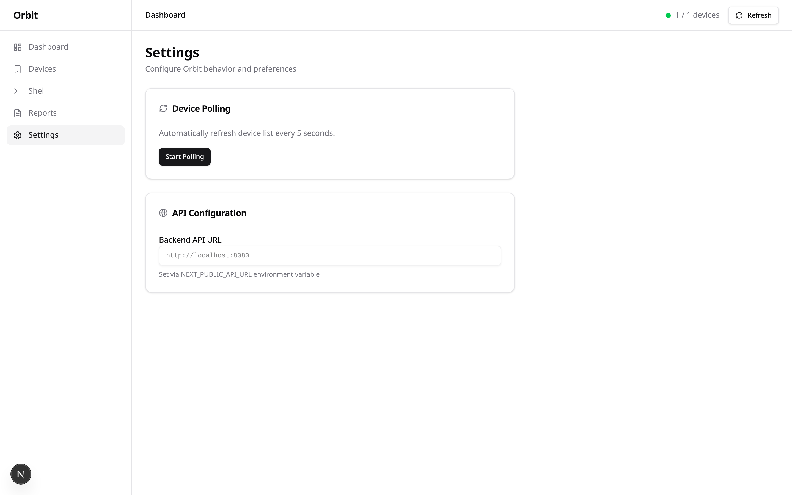

# Orbit

**Enterprise Android Device Management Platform**

Orbit is a full-stack platform for managing, monitoring, and analyzing Android devices over ADB (and beyond). Built with Clean Architecture in Rust (backend) and Next.js (frontend).






---

## Features

- **Real-time device discovery** — detects connected devices via ADB (USB & WiFi)
- **Live battery monitoring** — updates every 3 seconds with charge status
- **Interactive WebSocket shell** — full xterm.js terminal emulation via ADB PTY
- **System analysis** — SoC, RAM, storage, kernel, partitions
- **Network diagnostics** — dual-SIM, operator info, connection type
- **Installed apps inventory** — all packages with details
- **Comprehensive device reports** — exportable full device health summaries
- **Clean Architecture** — maintainable, testable, transport-agnostic design

---

## Screenshots

| Page | Preview |
|------|---------|
| **Dashboard** | [](screenshots/dashboard.png) |
| **Device Table** | [](screenshots/devices.png) |
| **Battery** | [](screenshots/battery.png) |
| **System Info** | [](screenshots/system.png) |
| **Storage** | [](screenshots/storage.png) |
| **Network** | [](screenshots/network.png) |
| **Apps** | [](screenshots/apps.png) |
| **Report** | [](screenshots/report.png) |
| **Shell** | [](screenshots/shell.png) |
| **Settings** | [](screenshots/settings.png) |

---

## Architecture

```
┌─────────────────────────────────────────────────┐
│                   Frontend                       │
│  Next.js 15 · TypeScript · Tailwind 4 · shadcn  │
└──────────────────┬──────────────────────────────┘
                   │  REST + WebSocket
┌──────────────────▼──────────────────────────────┐
│                   Backend                        │
│  Rust · Actix-web · Clean Architecture           │
│                                                  │
│  ┌─── API ────┐  ┌── Application ──┐            │
│  │  Routes     │  │  DeviceService  │            │
│  │  Handlers   │──│  ReportService  │            │
│  │  DTOs       │  │                 │            │
│  └─────────────┘  └───────┬─────────┘            │
│                           │                      │
│  ┌── Domain ──────────────▼──────────────┐       │
│  │  Models (Device, Info, System, etc)   │       │
│  │  Ports (AdbPort trait)                │       │
│  └──────────────┬────────────────────────┘       │
│                 │                                │
│  ┌── Infrastructure ─▼───────────────────┐       │
│  │  AdbExecutor · AdbParser · AdbCommands │       │
│  │  (shells out to `adb`)                 │       │
│  └────────────────────────────────────────┘       │
└──────────────────────────────────────────────────┘
```

### Layers (Clean Architecture)

| Layer | Responsibility | Dependencies |
|-------|---------------|-------------|
| **API** | HTTP handlers, request/response, routing | Application layer |
| **Application** | Use cases, orchestration, services | Domain layer |
| **Domain** | Business models, port interfaces | None (pure Rust) |
| **Infrastructure** | ADB execution, output parsing | Domain layer |

---

## Tech Stack

### Backend
| Technology | Purpose |
|------------|---------|
| **Rust** (edition 2024) | Systems programming, memory safety |
| **Actix-web 4** | High-performance HTTP & WebSocket framework |
| **Serde** + **serde_json** | JSON serialization |
| **Tokio** | Async runtime |
| **actix-ws 0.3** | WebSocket server for interactive shell |
| **Regex** | ADB output parsing |
| **Tracing** | Structured JSON logging |

### Frontend
| Technology | Purpose |
|------------|---------|
| **Next.js 15** (App Router) | React framework with SSR/RSC |
| **TypeScript** (strict) | Type safety |
| **Tailwind CSS 4** | Utility-first styling |
| **shadcn/ui** | Radix-based component library |
| **Zustand** | State management |
| **Lucide React** | Icon library |
| **xterm.js** | Terminal emulator for shell |
| **Inter** (local) | Font (no external CDN) |

### Infrastructure
| Tool | Purpose |
|------|---------|
| **ADB** (Android Debug Bridge) | Device communication |
| **Docker** | Containerized deployment |
| **pnpm** | Fast, disk-efficient package manager |
| **GitHub Actions** | CI/CD |

---

## Quick Start

### Prerequisites

- Rust 1.85+
- Node.js 22+
- pnpm 10+
- ADB (`android-tools` package)
- Android device with USB debugging enabled (or WiFi ADB)

### 1. Clone & Setup

```bash
git clone https://github.com/vitkuz573/orbit.git
cd orbit
```

### 2. Backend

```bash
cd backend
cargo run
```

The backend starts on `http://127.0.0.1:8080`.

### 3. Frontend

```bash
cd frontend
pnpm install
pnpm dev
```

The frontend starts on `http://localhost:3000`, with API requests proxied to the backend.

### Docker

```bash
docker compose up --build
```

---

## API Endpoints

### REST

| Method | Endpoint | Description |
|--------|----------|-------------|
| `GET` | `/api/v1/devices` | List all connected devices |
| `GET` | `/api/v1/devices/{id}` | Get single device details |
| `GET` | `/api/v1/devices/{id}/info` | Detailed device info |
| `GET` | `/api/v1/devices/{id}/system` | CPU, RAM, swap, kernel info |
| `GET` | `/api/v1/devices/{id}/storage` | Partitions, disk usage |
| `GET` | `/api/v1/devices/{id}/battery` | Battery status, health, BMS data |
| `GET` | `/api/v1/devices/{id}/network` | Cellular, SIM, operator, connection |
| `GET` | `/api/v1/devices/{id}/apps` | Installed packages |
| `GET` | `/api/v1/devices/{id}/report` | Comprehensive device report |

### WebSocket

| Endpoint | Description |
|----------|-------------|
| `/api/v1/devices/{id}/shell/ws` | Interactive ADB shell via WebSocket |

### Example

```bash
curl -s http://localhost:8080/api/v1/devices | jq
```

---

## Project Structure

```
orbit/
├── backend/
│   ├── src/
│   │   ├── api/               # HTTP handlers, routes, DTOs
│   │   │   └── routes.rs
│   │   ├── application/       # Use cases, services
│   │   │   ├── device_service.rs
│   │   │   └── report_service.rs
│   │   ├── domain/            # Domain models, ports
│   │   │   ├── models.rs
│   │   │   └── ports.rs
│   │   ├── infrastructure/    # ADB execution, parsing
│   │   │   ├── adb_executor.rs
│   │   │   └── adb_parser.rs
│   │   ├── config/            # App settings
│   │   │   └── mod.rs
│   │   ├── error.rs           # Error types
│   │   └── main.rs
│   ├── Cargo.toml
│   └── Dockerfile
├── frontend/
│   ├── app/                   # Next.js App Router pages
│   │   ├── (dashboard)/       # Protected dashboard layout
│   │   │   ├── page.tsx       # Dashboard home
│   │   │   ├── devices/       # Device list & detail pages
│   │   │   ├── shell/         # WebSocket interactive shell
│   │   │   ├── reports/       # Device reports page
│   │   │   └── settings/      # Settings page
│   │   ├── globals.css        # Tailwind + theme
│   │   └── layout.tsx         # Root layout
│   ├── components/
│   │   ├── dashboard/         # Dashboard widgets
│   │   ├── layout/            # Sidebar, header
│   │   └── ui/                # shadcn/ui primitives
│   ├── lib/
│   │   ├── api.ts             # Typed API client
│   │   └── utils.ts           # cn(), formatters
│   ├── store/
│   │   └── index.ts           # Zustand store
│   └── types/
│       └── index.ts           # TypeScript types
├── .github/workflows/         # CI pipeline
├── docker-compose.yml
├── Makefile
└── README.md
```

---

## Configuration

### Backend

Settings are loaded from environment variables or `.env` file:

| Variable | Default | Description |
|----------|---------|-------------|
| `HOST` | `127.0.0.1` | Backend bind address |
| `PORT` | `8080` | Backend port |
| `ADB_PATH` | `adb` | Path to ADB binary |

### Frontend

| Variable | Default | Description |
|----------|---------|-------------|
| `NEXT_PUBLIC_API_URL` | `http://localhost:8080` | Backend API URL |

---

## Screenshots

Screenshots are generated using Playwright. To regenerate:

```bash
pnpm add -g playwright
cd frontend
pnpm exec playwright install chromium
PLAYWRIGHT_BASE_URL=http://localhost:3000 npx playwright test scripts/screenshots.spec.ts
```

---

## License

MIT © [Vitaly Kuzyaev](https://github.com/vitkuz573)
